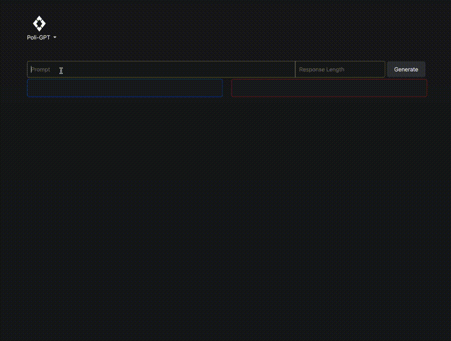

# PoliGPT


PoliGPT is a web application that allows users to compare the differences between liberal and conservative news. Users can generate from both liberal and conservative GPT-2 models with the same prompt and visualize both responses side by side. Users can also use a basic text search to browse news articles that were used to train the models.

## Models and Dataset
More information regarding the models and dataset are available on Hugging Face:
- [liberal-gpt2](https://huggingface.co/jonathancsci/liberal-gpt2)
- [conservative-gpt2](https://huggingface.co/jonathancsci/conservative-gpt2)
- [liberal-and-conservative-news dataset](https://huggingface.co/datasets/jonathancsci/liberal-and-conservative-news)

## Running the project
Prerequisites: Docker must be installed on your system.
1. Clone the repository (for systems without CUDA, use the 'cpu' branch).
2. Download the two .csv files from the [liberal-and-conservative-news dataset](https://huggingface.co/datasets/jonathancsci/liberal-and-conservative-news) and place them in the `backend/app/data/` directory.
3. Create a .env file in the root of the project with the following fields:
```.env
POSTGRES_PASSWORD=your_value
POSTGRES_USER=your_value
POSTGRES_DB=your_value
```
4. In the root of the project, run `docker compose up` (this may take from 10min-1hr to complete, depending on your system).
5. Navigate to localhost to see the app running.

## License
This software is licensed under the [`MIT-0`](https://github.com/aws/mit-0) license. The intent is to effectively place this work in the public domain.